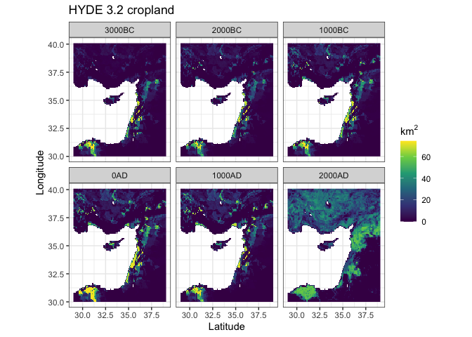
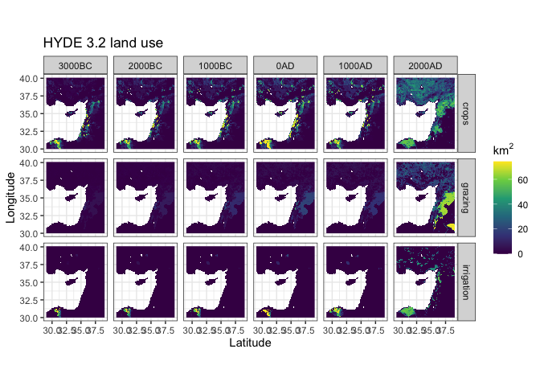
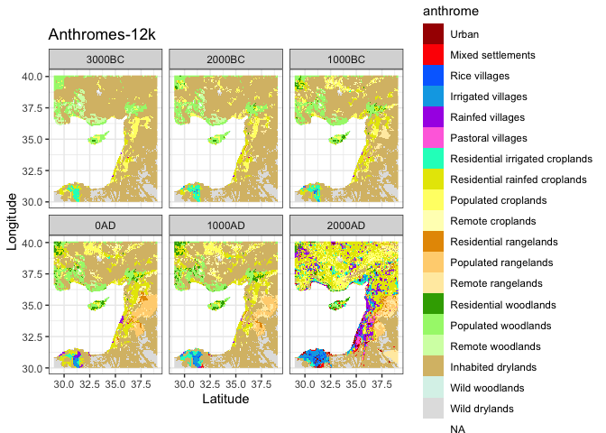

<!-- README.md is generated from README.Rmd. Please edit that file -->

# anthromes: Tools for analyzing long-term population and land use in R

<!-- badges: start -->

[](https://lifecycle.r-lib.org/articles/stages.html#experimental)
[](https://codecov.io/gh/nick-gauthier/anthromes?branch=master)
[](https://github.com/nick-gauthier/anthromes/actions)
<!-- badges: end -->

An R package for analyzing historical land use and population on a
regional to global scales. It includes functions to download HYDE 3.2
and Anthromes-12k data (from the Anthromes-12k-DGG repository at
<https://doi.org/10.7910/DVN/E3H3AK>), apply the anthromes
classification, extract raster data using an equal-area discrete global
grid system, and generate common summary tables and visualizations.

It is based on (and supersedes) the R research compendium used to
generate the analyses and figures for:

> Ellis, E.C., N. Gauthier, K. Klein Goldewijk, R. Bliege Bird, N.
> Boivin, S. Diaz, D. Fuller, J. Gill, J. Kaplan, N. Kingston, H. Locke,
> C. McMichael, D. Ranco, T. Rick, M.R. Shaw, L. Stephens, J.C.
> Svenning, J.E.M. Watson, (2021). *People have shaped most of
> terrestrial nature for at least 12,000 years*. PNAS.
> <https://doi.org/10.1073/pnas.2023483118>

## Installation

You can install the development version from
[GitHub](https://github.com/) with:

``` r
# install.packages("devtools")
devtools::install_github("nick-gauthier/anthromes")
```

## Example

``` r
library(anthromes)
library(stars)
#> Loading required package: abind
#> Loading required package: sf
#> Linking to GEOS 3.8.1, GDAL 3.1.4, PROJ 6.3.1
library(ggplot2)
```

Read in the anthromes data as a stars object. stars in an R package for
working with space-time cubes like the HYDE 3.2 data, which are spatial
rasters representing multiple time steps. A stars object prints two
pieces of information, the attribute data (which is essentially a tibble
that can be manipulated via typical tidyverse functions) and dimension
information (which records the spatial and temporal dimensions of the
object).

``` r
hyde_med
#> stars object with 3 dimensions and 6 attributes
#> attribute(s):
#>      crops           grazing           rice              pop           
#>  Min.   : 0.000   Min.   : 0.000   Min.   : 0.000   Min.   :      0.0  
#>  1st Qu.: 0.000   1st Qu.: 0.068   1st Qu.: 0.000   1st Qu.:     65.2  
#>  Median : 1.399   Median : 0.942   Median : 0.000   Median :    222.5  
#>  Mean   : 8.579   Mean   : 4.007   Mean   : 0.106   Mean   :   2060.5  
#>  3rd Qu.:10.349   3rd Qu.: 3.382   3rd Qu.: 0.000   3rd Qu.:    620.8  
#>  Max.   :74.328   Max.   :74.077   Max.   :73.823   Max.   :1802804.1  
#>  NA's   :27132    NA's   :27132    NA's   :27132    NA's   :27132      
#>   irrigation          urban       
#>  Min.   : 0.000   Min.   : 0.000  
#>  1st Qu.: 0.000   1st Qu.: 0.000  
#>  Median : 0.000   Median : 0.000  
#>  Mean   : 1.372   Mean   : 0.114  
#>  3rd Qu.: 0.000   3rd Qu.: 0.000  
#>  Max.   :74.203   Max.   :74.328  
#>  NA's   :27132    NA's   :27132   
#> dimension(s):
#>      from   to  offset      delta refsys point            values x/y
#> x    2509 2629    -180  0.0833333 WGS 84 FALSE              NULL [x]
#> y     600  720 89.9999 -0.0833333 WGS 84 FALSE              NULL [y]
#> time    1    6      NA         NA     NA    NA 3000BC,...,2000AD
```

You can easily plot these objects in ggplot using geom\_stars().

``` r
ggplot() +
  geom_stars(data = hyde_med) +
  scale_fill_viridis_c(na.value = NA, name = expression(km^2)) +
  facet_wrap(~time) +
  labs(title = 'HYDE 3.2 cropland', x = 'Latitude', y = 'Longitude') +
  coord_quickmap() +
  theme_bw()
```

 By
default, geom\_stars will only plot the first attribute. If you’d like
to plot multiple attributes at a time, the easiest way is to convert the
attributes to an extra dimension.

``` r
ggplot() +
  geom_stars(data = merge(hyde_med[c(1:2,5),,,])) +
  scale_fill_viridis_c(na.value = NA, name = expression(km^2)) +
  facet_grid(attributes~time) +
  labs(title = 'HYDE 3.2 land use', x = 'Latitude', y = 'Longitude') +
  coord_quickmap() +
  theme_bw()
```



You can easily animate these data using gganimate.

``` r
ggplot() +
  geom_stars(data = hyde_med) +
  scale_fill_viridis_c(na.value = NA, name = expression(km^2)) +
  # use transition_states() from gganimate instead of facet_wrap to animate
  gganimate::transition_states(time, transition_length = 0.5) +
  labs(title = 'HYDE 3.2 land use', 
       subtitle = 'Cropland at {closest_state}', 
       x = 'Latitude', y = 'Longitude') +
  coord_quickmap() +
  theme_bw()
```


## Anthromes classification

The main function of the package is get\_anthromes(), which applies the
anthromes v2.1 classification algorithm originally presented in &gt;
Ellis, E.C., A.H.W. Beusen, K. Klein Goldewijk, (202). *Anthropogenic
Biomes: 10,000 BCE to 2015 CE*. Land, 9 (5). &gt;
<https://doi.org/10.3390/LAND9050129>

And later modified in *Ellis et al. 2021* above.


get\_anthromes() requires the HYDE 3.2 data in a spatio-temporal array,
along with a 2-dimensional array of fixed input variables such as land
area and potential natural vegetation.

``` r
anthromes <- get_anthromes(hyde_med, inputs_med)
```

The result is a stars object with the resulting anthromes
classification, with the same spatial and temporal dimensions as the
original HYDE data.

``` r
anthromes
#> stars object with 3 dimensions and 1 attribute
#> attribute(s):
#>                          anthrome     
#>  Inhabited drylands           :33235  
#>  NODATA                       :27132  
#>  Residential rainfed croplands: 6460  
#>  Wild drylands                : 4204  
#>  Populated woodlands          : 4093  
#>  Populated croplands          : 3842  
#>  (Other)                      : 8880  
#> dimension(s):
#>      from   to  offset      delta refsys point            values x/y
#> x    2509 2629    -180  0.0833333 WGS 84 FALSE              NULL [x]
#> y     600  720 89.9999 -0.0833333 WGS 84 FALSE              NULL [y]
#> time    1    6      NA         NA     NA    NA 3000BC,...,2000AD
```

As above, these data can be easily plotted in ggplot using geom\_stars.
The default anthromes color scheme is provided in the function
anthrome\_colors() for convenience.

``` r
ggplot() +
  geom_stars(data = anthromes) +
  facet_wrap(~time) +
  coord_quickmap() +
  scale_fill_manual(values = anthrome_colors(), drop = TRUE) +
  theme_bw() +
  labs(title = 'Anthromes-12k', x = 'Latitude', y = 'Longitude')
```

 Create
nicely formatted summaries of the percent land area in each anthrome.

``` r
anthrome_summary(anthromes, inputs_med)
#> # A tibble: 21 x 7
#>    anthrome            `3000BC`  `2000BC`  `1000BC`      `0AD` `1000AD` `2000AD`
#>    <fct>                    [%]       [%]       [%]        [%]      [%]      [%]
#>  1 Urban              0.000000… 0.000000… 0.000000…  0.000000… 0.00000…  1.3435…
#>  2 Mixed settlements  0.010362… 0.010362… 0.010362…  0.021014… 0.12557…  1.1911…
#>  3 Rice villages      0.000000… 0.000000… 0.010689…  0.085413… 0.14963…  0.8229…
#>  4 Irrigated villages 0.000000… 0.105933… 0.287752…  0.546544… 1.05498…  5.4193…
#>  5 Rainfed villages   0.038284… 0.048964… 0.079556…  0.712320… 0.14186…  7.1569…
#>  6 Pastoral villages  0.000000… 0.000000… 0.000000…  0.000000… 0.00000…  0.9703…
#>  7 Residential irrig… 1.154401… 1.280373… 1.158554…  0.569328… 1.15223…  4.0399…
#>  8 Residential rainf… 2.358643… 3.554338… 7.731140… 11.824162… 9.47797… 27.5704…
#>  9 Populated croplan… 4.983536… 5.683022… 5.204140…  4.615843… 5.16068… 10.5713…
#> 10 Remote croplands   0.521449… 1.466865… 2.471521…  3.037484… 3.70718…  2.0869…
#> # … with 11 more rows
```

### How to cite

This package is currently in development, with submission to rOpenSci
planned shortly. In the interim, please cite the original R compendium
at:

> Gauthier, Nicolas (2021). *Anthromes 12K DGG (V1) analysis code and R
> research compendium*. Online at Harvard Dataverse,
> <https://doi.org/10.7910/DVN/6FWPZ9>
